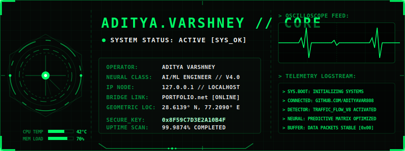
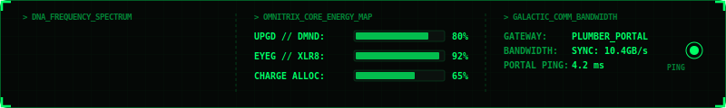
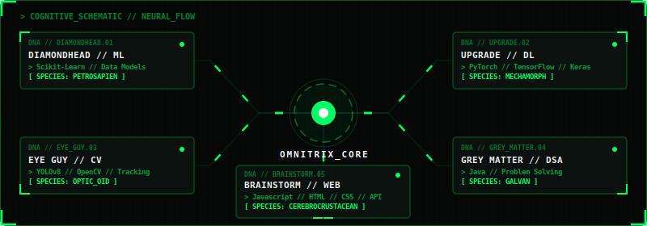
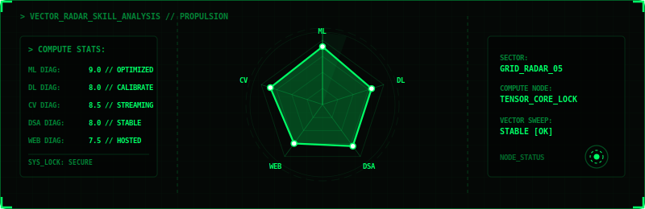
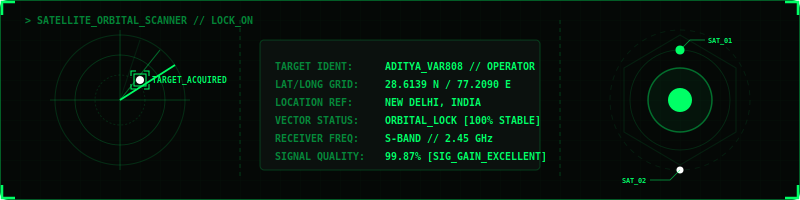

<div align="center">
  
  <!-- Glowing Cyberpunk Title Art -->
  <pre>
<font color="#00ff66"><b>
 █████╗ ██████╗ ██╗████████╗██╗   ██╗ █████╗ ██╗   ██╗ █████╗ ██████╗  █████╗  ██████╗  █████╗ 
██╔══██╗██╔══██╗██║╚══██╔══╝╚██╗ ██╔╝██╔══██╗ ██║   ██║██╔══██╗██╔══██╗██╔══██╗██╔═══██╗██╔══██╗
███████║██║  ██║██║   ██║    ╚████╔╝ ███████║ ██║   ██║███████║██████╔╝╚█████╔╝██║   ██║╚█████╔╝
██╔══██║██║  ██║██║   ██║     ╚██╔╝  ██╔══██║ ╚██╗ ██╔╝██╔══██║██╔══██╗██╔══██╗██║   ██║██╔══██╗
██║  ██║██████╔╝██║   ██║      ██║   ██║  ██║  ╚████╔╝ ██║  ██║██║  ██║╚█████╔╝╚██████╔╝╚█████╔╝
╚═╝  ╚═╝╚═════╝ ╚═╝   ╚═╝      ╚═╝   ╚═╝  ╚═╝   ╚═══╝  ╚═╝  ╚═╝╚═╝  ╚═╝ ╚════╝  ╚═════╝  ╚════╝ 
</b></font>
  </pre>

  <!-- Custom Animated HUD Header -->
  

  <br><br>

  <!-- Hardware Resource & Diagnostic Grid -->
  

</div>

<br>

### 📡 INTERACTIVE SYSTEM CONSOLE // MOCK SHELL

```bash
$ whoami
operator: adityavar808 // Aditya Varshney
status: ACTIVE [SYS_OK]
bridge_ip: 127.0.0.1 (localhost)

$ sysctl -n hw.neural_engine
[ACTIVE] Tensor Core processing array online (9.87 GFLOPS load capacity)

$ cat protocols.json
{
  "core_focus": [
    "Computer Vision & Pattern Recognition",
    "Deep Learning Architecture Design",
    "Real-time Inference Optimization"
  ],
  "languages": ["Python", "Java", "Javascript", "C++ (Intermediate)"],
  "libraries": ["PyTorch", "TensorFlow", "OpenCV", "Keras", "DeepSORT"]
}
```

---

### 🧠 CORE TELEMETRY // CONNECTIVE NEURAL SCHEMATIC

<div align="center">
  <!-- Interactive-looking Connected Circuit Board -->
  
</div>

---

### 📊 VECTOR ANALYTICS // PROFICIENCY SWEEP

<div align="center">
  <!-- Custom Radar Skills Chart -->
  
</div>

---

### 📂 SECURE PROJECT DIRECTORIES // ENCRYPTED LOGS

<details>
  <summary>📁 <b>[LOG_ENTRY_094] : AI-DRIVEN TRAFFIC VIOLATION DETECTION PIPELINE</b></summary>
  <br>
  <blockquote>
    <b>[CLASSIFICATION]</b>: Computer Vision / Autonomous Surveillance / Object Detection<br>
    <b>[DESCRIPTION]</b>: Engineered a high-performance roadway surveillance pipeline. Automates vehicle classification, tracks multi-frame speed coordinates, and flags helmet compliance &amp; red-light violations in real time.<br>
    <b>[ENGINE]</b>: YOLOv8, PyTorch, DeepSORT, OpenCV, Python<br>
    <b>[STORAGE_BLOCK]</b>: <code>[ACTIVE_DEPLOYMENT // SEGMENT_0xF49A]</code>
  </blockquote>
</details>

<details>
  <summary>📁 <b>[LOG_ENTRY_095] : STREAMING VIDEO VECTOR SCANNER</b></summary>
  <br>
  <blockquote>
    <b>[CLASSIFICATION]</b>: Real-Time Stream Analytics / Spatial Motion Tracking<br>
    <b>[DESCRIPTION]</b>: Architected a low-latency surveillance scanning node. Tracks dozens of simultaneous objects, maps coordinate matrices across user-defined zones, and triggers automated network requests on security breaches.<br>
    <b>[ENGINE]</b>: OpenCV, TensorFlow Lite, FastAPI, Python<br>
    <b>[STORAGE_BLOCK]</b>: <code>[STABLE_COMPILATION // SEGMENT_0x112B]</code>
  </blockquote>
</details>

---

### 🛰️ GLOBAL COORDINATE TARGETING // RADAR Lock

<div align="center">
  <!-- Tactical New Delhi Coordinate Target Map -->
  
</div>

---

### 🖥️ LIVE MAINFRAME NETWORK DUPLEX

<div align="center">
  <!-- Network matrix traffic chart -->
  
</div>

<br>

```
> CORE PROCESS MONITOR [ACTIVE]
-----------------------------------------------------------------------------
PID      PROCESS NAME               CPU      RAM      STATUS      TARGET
-----------------------------------------------------------------------------
[0x8A1]  traffic_violator_yolov8    85.2%    4.2GB    RUNNING     Stream_01
[0x9F2]  anomaly_tracker_sort       62.4%    2.1GB    RUNNING     Stream_02
[0x3B4]  neural_flow_calibrator     12.8%    1.8GB    STABLE      Epoch_240
[0xC18]  web_systems_vercel_node    02.1%    0.4GB    IDLE        portfolio
-----------------------------------------------------------------------------
```

---

### 📊 MAINFRAME TELEMETRY // DYNAMIC STATS

<div align="center">
  <table border="0" cellpadding="0" cellspacing="0" width="100%">
    <tr>
      <td width="50%" align="center">
        
      </td>
      <td width="50%" align="center">
        
      </td>
    </tr>
  </table>
</div>

<br>

<div align="center">
  <!-- Contribution Snake tracking -->
  
</div>

---

### 🔒 DECRYPTED SECRET VAULT // CIPHERTEXT

```text
┌── [DECRYPTED VAULT NODE: #SECRET_KEY] ────────────────────────────────────┐
│                                                                           │
│  CIPHERTEXT:                                                              │
│  "QnVpbGRpbmcgdGhlIGZ1dHVyZSBvZiBBSS9NTCBvbmUgZXBvY2ggYXQgYSB0aW1lLi4u"    │
│                                                                           │
│  DECRYPTION PROTOCOL:                                                     │
│  Run base64 decode in your console to decrypt operator statement:         │
│  $ echo "QnVpbGRpbmc..." | base64 --decode                                │
│                                                                           │
└───────────────────────────────────────────────────────────────────────────┘
```

---

### 📡 ESTABLISH COMM_LINK // CHANNELS

<div align="center">
  <a href="mailto:adityavarshney808@gmail.com">
    
  </a>
  <a href="https://linkedin.com/in/adityaavarshney" target="_blank">
    
  </a>
  <a href="https://portfolioaditya-gamma.vercel.app/" target="_blank">
    
  </a>
</div>

<br>

<div align="right">
  
</div>
