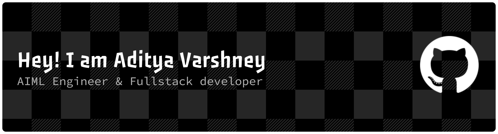

<!-- ========================================== -->
<!-- HERO HEADER SECTION                        -->
<!-- ========================================== -->

  

 

  
  
  
  

  
  
  
  

  

<!-- ========================================== -->
<!-- ABOUT ME & EXECUTIVE SUMMARY (UI/UX CARD)  -->
<!-- ========================================== -->

<table border="0" cellpadding="12" cellspacing="0" width="100%">
  <tr>
    <td width="55%" valign="top" style="background: #0d1117; border: 1px solid #30363d; border-radius: 12px; padding: 20px;">
      <h2 style="color: #06b6d4; margin-top: 0;">⚡ About Me & Engineering Focus</h2>
      

        I am an <b>AI/ML Engineer</b> specializing in low-latency computer vision systems, high-frame-rate stream analysis, deep neural model optimization, and autonomous AI agents.
      

      <ul style="font-size: 13px; color: #8b949e; line-height: 1.6; padding-left: 20px;">
        <li>🚀 <b>Core Mission:</b> Building real-time visual intelligence applications & neural network pipelines.</li>
        <li>🧠 <b>Current Focus:</b> Deep neural model quantization, real-time object tracking, & LLMs.</li>
        <li>💡 <b>Philosophy:</b> Clean modular architecture, low latency optimization, & production code.</li>
        <li>💬 <b>Ask Me About:</b> PyTorch, OpenCV, YOLOv8, FastAPI, WebRTC, CUDA & AI deployments.</li>
      </ul>
    </td>
    <td width="45%" valign="top" style="background: #0d1117; border: 1px solid #30363d; border-radius: 12px; padding: 20px;">
      <h3 style="color: #7928ca; margin-top: 0;">💻 Terminal Telemetry</h3>
      

        
      

    </td>
  </tr>
</table>

  

<!-- ========================================== -->
<!-- TECH STACK & TOOLKIT                       -->
<!-- ========================================== -->

<h2>🛠️ Tech Stack & Engineering Toolkit</h2>

<table border="0" cellpadding="12" cellspacing="0" width="100%">
  <tr>
    <td width="50%" valign="top" style="background: #0d1117; border: 1px solid #30363d; border-radius: 10px; padding: 16px;">
      <h4 style="color: #06b6d4; margin-top: 0;">🧠 AI, Machine Learning & Computer Vision</h4>
      
    </td>
    <td width="50%" valign="top" style="background: #0d1117; border: 1px solid #30363d; border-radius: 10px; padding: 16px;">
      <h4 style="color: #7928ca; margin-top: 0;">⚙️ Core Programming Languages</h4>
      
    </td>
  </tr>
  <tr>
    <td width="50%" valign="top" style="background: #0d1117; border: 1px solid #30363d; border-radius: 10px; padding: 16px;">
      <h4 style="color: #0070f3; margin-top: 0;">🌐 Web & Microservices Frameworks</h4>
      
    </td>
    <td width="50%" valign="top" style="background: #0d1117; border: 1px solid #30363d; border-radius: 10px; padding: 16px;">
      <h4 style="color: #26a641; margin-top: 0;">🗄️ Databases & Developer Tooling</h4>
      
    </td>
  </tr>
</table>

  

<!-- ========================================== -->
<!-- GITHUB ANALYTICS & DASHBOARD               -->
<!-- ========================================== -->

<h2>📊 GitHub Telemetry & Performance Dashboard</h2>

  <h3>🏆 GitHub Trophies</h3>
  

 

<table border="0" cellpadding="0" cellspacing="0" width="100%">
  <tr>
    <td width="50%" align="center">
      
    </td>
    <td width="50%" align="center">
      
    </td>
  </tr>
  <tr>
    <td width="50%" align="center">
       
      
    </td>
    <td width="50%" align="center">
       
      
    </td>
  </tr>
</table>

  

<!-- ========================================== -->
<!-- LIVE ACTIVITY & CONTRIBUTION MATRIX        -->
<!-- ========================================== -->

<h2>📈 Live Contribution & Telemetry Graph</h2>

  

 

  <h4>🐍 Contribution Matrix (Snake Animation)</h4>
  

  

<!-- ========================================== -->
<!-- FEATURED PROJECTS SHOWCASE                 -->
<!-- ========================================== -->

<h2>🌟 Featured Projects</h2>

<table border="0" cellpadding="12" cellspacing="0" width="100%">
  <tr>
    <td width="33%" valign="top" style="border: 1px solid #30363d; border-radius: 10px; background: #0d1117; padding: 18px;">
      <h3 style="color: #06b6d4; margin-top: 0;">📹 Real Time Video Analysis</h3>
      

        High-throughput visual processing framework for multi-object tracking, speed calculation, and boundary infraction telemetry.
      

      

        
        
        
        
      

      

        
      

    </td>
    <td width="33%" valign="top" style="border: 1px solid #30363d; border-radius: 10px; background: #0d1117; padding: 18px;">
      <h3 style="color: #06b6d4; margin-top: 0;">⚡ Zenix</h3>
      

        Autonomous AI task automation framework designed for complex workflow orchestration, vector search, and decision loops.
      

      

        
        
        
        
      

      

        
      

    </td>
    <td width="33%" valign="top" style="border: 1px solid #30363d; border-radius: 10px; background: #0d1117; padding: 18px;">
      <h3 style="color: #06b6d4; margin-top: 0;">🤖 InterviewVerse AI</h3>
      

        AI-driven mock interview simulator featuring real-time speech analytics, sentiment scoring, and candidate evaluations.
      

      

        
        
        
        
      

      

        
      

    </td>
  </tr>
</table>

  

<!-- ========================================== -->
<!-- FOOTER SECTION                             -->
<!-- ========================================== -->

  <h3>✨ Thanks for visiting!</h3>
  
Feel free to check out my repositories or reach out for collaboration.

  

    
  

  

